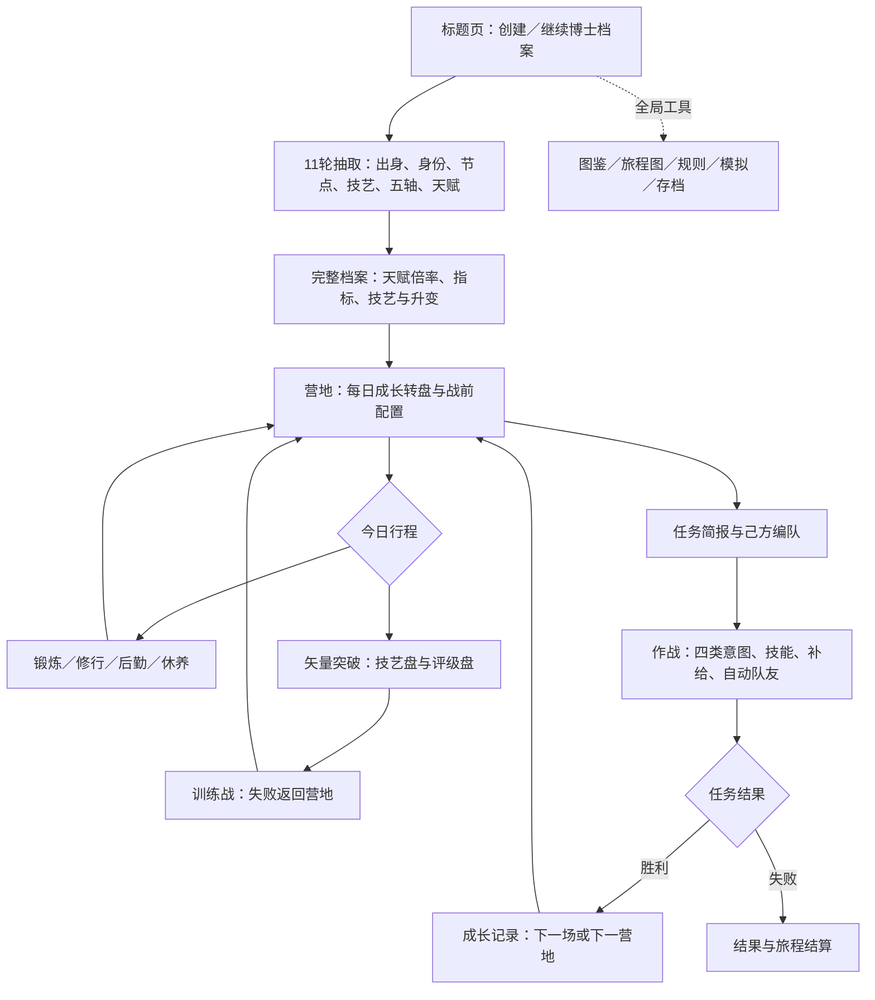

# 泰拉命运转盘 · UI设计与验收 v19

2026-10-02。依据用户指定的 [potatoDesignSkill](https://github.com/chenhaha299-hub/potatoDesignSkill) 重新设计并实现。Skill 已安装到 Codex 与 WorkBuddy 的 skills 目录。

## 1. 设计目标

面向明日方舟玩家与初次接触轮盘策略游戏的中文用户，覆盖电脑和手机。核心任务是创建博士、看懂抽取结果、安排成长、观察敌方意图并完成作战。以 PRTS 终端为视觉主题，使用原创几何界面，不依赖官方立绘或外部字体加载。

原则：一次一个主要任务；正文优先于装饰；每个按钮明确动作；结果和下一步分开；长内容在自己的区域内滚动。玩家需要的数值与剧情保持可见，内部实现信息不占任务区。

## 2. 游戏路径

模拟保留正式存档。当前浏览器自动保存每次决策，跨设备通过导入导出迁移。

## 3. 页面结构和状态

| 页面 | 主任务和布局 | 空状态／等待 | 成功／异常反馈 |
|---|---|---|---|
| 首页 | 左侧旅程说明，右侧创建表单；命运种子收进高级设置 | 无档案时提供创建；载入使用 PRTS 提示 | 已有档案显示进度和继续入口；替换前确认并提供导出 |
| 建角 | 步数、盘面、完整选项、结果、下一轮、人物档案 | 尚未抽取明确显示；旋转时禁用重复操作 | 停盘后指针、序号、结果和档案对应同一选项 |
| 完整档案 | 出身、五轴评级、天赋倍率、源石技艺和 ABC | 招式未解锁显示 M100／M200 条件 | 确认档案进入营地 |
| 营地 | 准备日、成长盘、战前配置、成长记录和档案 | 未成长时说明记录用途；未解锁配置禁用 | 结果显示倍率和实际增长；训练未通过说明无成长 |
| 突破 | 技艺／评级切换、对手名称、进入作战 | 两次揭晓有同一转盘反馈 | 训练失败返回日程，成功按既有公式成长 |
| 简报 | 背景、任务、队伍、配置和开始作战 | 不存在额外计划选择 | 明确开始按钮；长队伍可正常浏览 |
| 战场 | 阵列、ABC正文、档案、记录、行动栏 | 等待自动单位时标明正在行动；不可用招式禁用 | 伤害、状态与行动记录即时刷新；撤离有确认 |
| 图鉴 | 搜索、池筛选、卡片、招式弹窗 | 零结果提供修改名称／切换池提示 | 展示消耗、技能效果、召唤规则和升变 |
| 旅程图 | 节点卡与任务弹窗 | 展示未到达节点 | 明确节点背景与任务 |
| 存档／结算 | 模态操作、结果、后续入口 | 空档案提示创建 | 自动保存说明、导出／导入入口；现有异常提示沿用 |

以上为实际页面状态定义；本次浏览器实测覆盖建角、天赋档案、营地、训练失败、战斗、图鉴空结果、招式弹窗、旅程图、存档、新建与撤离确认。导入损坏文件和全战役结局未在本次逐一重演，相关回归与历史证据见后文。

## 4. 转盘设计

统一组件覆盖出生地22项、种族30项、身份2项、节点12项、源石技艺181项、五项战力各17项、成长天赋9项、每日8项、突破技艺139项和突破评级17项。

- 保留每个实际选项的独立彩色扇区；颜色从五个协调色系轮换，隐藏标记和概率使用文字，颜色不承担唯一含义。
- 静止金属外圈、螺钉、120格刻度、金色拨针、独立旋转盘体和固定中心轴，形成实体转盘层次。
- 完整动效3.9秒：加速、持续旋转、减速、轻微回弹、准确落点。旋转由逐帧角度驱动，拨针随扇区经过摆动，结果读数和进度同步。
- 尊重系统减少动态效果偏好，简化为0.45秒。提供显式“完整动效／简化动效”切换，偏好仅保存在本机界面设置中。
- 不把181个长全名缩成几像素字。密集盘正常视图显示扇区序号；×4显示可读技艺简称。所有完整名称、原型和真实概率在列表中，结果完整显示在独立读数区。SVG标题也保留全名。
- 较小盘直接显示名称；17档战力用字母＋类别两行，细分级保留在完整选项和结果中。长名称适当缩写。
- 列表检索只筛选浏览结果，全部扇区和抽取池保留。点选浏览明确标注“浏览选项·不改变抽取结果”，可返回原抽取结果。
- 盘面扇区等宽，真实权重不同，提示“概率见列表”。隐藏池仍为普通模式1%、传奇之路15%，不由扇区面积推断概率。
- 手机完整选项默认收起，有明确展开入口；放大盘在自己的窗口中滚动，不造成页面横向溢出。建角和图鉴允许纵向浏览，战斗保持一屏框架。

## 5. 可实施的视觉规范

| 项目 | 规范 |
|---|---|
| 主色系 | 深蓝灰背景、青色信息、暖金主操作、柔红敌方；中性正文贯穿 |
| 关键色值 | 背景 `#0b141e`，面板 `#13212e`，正文 `#edf5fa`，次正文 `#acbecb`，青 `#8edbdc`，金 `#efbb72`，红 `#f9aaa5` |
| 字体 | 系统中文无衬线栈：苹方／微软雅黑／Noto Sans SC；数字序号使用 Consolas 回退；不加载外部字体 |
| 排版 | 首页主标题42px；页面标题30px，手机24px；正文14px；结果15px；列表14px；战场技能12px、桌面记录12px、手机记录11px |
| 间距 | 常规6／8／12／16／24px；桌面外边距28px，手机12–16px；面板圆角8px |
| 控件 | 主按钮46–48px；手机主操作、导航、缩放、补给、确认入口至少44px；桌面常用次按钮32–36px |
| 状态 | 清晰禁用、键盘 focus-visible 青色轮廓、选中轮廓、文字状态标签、模态遮罩和关闭按钮 |
| 内容溢出 | 名称可换行；过长正文局部滚动；320px短屏招式区改为整区滚动，正文不被压成零高度 |

正文关键配色对比度实算为8.55–14.82:1，主按钮9.33:1，抽取结果10.20:1。明细见 `artifacts/v19/contrast.json`。这些结果针对列出的颜色组合，不等于每个像素或每个禁用状态的无障碍认证。

## 6. 摩擦问题与修正

| 原问题 | 修正 |
|---|---|
| 初始界面说明和设置混杂 | 入口集中于创建表单，种子收起，主按钮唯一突出 |
| 密集轮盘字极小且模糊 | 正常盘序号、放大简称、完整列表、独立结果读数 |
| 转盘缺少旋转质感 | 转动盘体与静止边框分离，刻度、拨针、实时读数和回弹 |
| 多行战力标签互相挤压 | 盘面两行，完整分级在列表及读数 |
| 原滚动按钮遮住结果 | 取消浮动覆盖，结果和后续按钮按顺序排列 |
| 电脑技能正文被压成零高 | 技能纵列和档案／日志并列，三段正文有真实显示高度 |
| 手机撤离入口隐藏 | 恢复可见，暂停、托管、撤离均可点击 |
| 窄屏协同占用过多空间 | 缩紧选择框；短屏保留局部阅读与全部操作 |
| 搜索空结果不说明下一步 | 明确提示修改名称或切换技艺池 |

## 7. 本次验收证据

- 最终代码 `node --test tests/*.test.mjs`：43项通过，0失败。含全卡招式、存档重播、任务流程、转盘权重、1320次实际建角映射和新增旋转落点／运动曲线检查。
- 运动测试覆盖2、8、9、12、17、22、30、139、181项中每一个落点，验证初末角、指针对应选项、加速、递减速度和小幅回弹。
- 浏览器真实操作完成11轮建角，获得成长天赋A、倍率×1.15并进入档案；每日盘进入矢量突破，139项技艺及17档评级可切换；进行一次技能直放与托管训练，训练未通过后正常回营地。
- 完整动效实测中间帧为加速阶段，进度10%，角度150.548°，实时读数随扇区变化；另一次初帧角度58.616°、时长3900ms。系统减少动态效果下验证450ms模式，并通过界面切换回完整模式。
- 181项转盘检索“维什戴尔”只留下1个列表结果，但181扇区不变；浏览爆裂黎明后返回原结果“问雪（仇白）”，未改变抽取。
- 1280×720桌面战场：文档高度720，无横向溢出；修正后三段技能正文高度57–58px、字号12px。
- 390×844手机战场：文档高度844，无横向溢出；阵列、描述、档案、日志、按钮均在框架内。较多单位在阵列内部滚动。
- 320×720窄屏：文档高度720，无横向溢出，操作栏底部714px；修正后技能正文实际高度74／90／74px，通过招式区滚动阅读。
- 模拟梅菲斯特：宿主重装组长2257生命、宿主流浪者1900生命、狂暴宿主士兵1782生命，均显示召唤物标记和独立行动条；评级按既有面板公式显示C。此处是本次B−主人模拟面板，不是全等级固定召唤数值。
- 图鉴检索、空状态、霜叶冬痕招式弹窗、旅程图、存档、替换档案与撤离确认均经实际UI操作；浏览器错误日志为空。
- 截图在 `artifacts/v19/ui/`，结构化记录在 `ui-checks.json`，发布结果在 `deployment.json`（发布后写入）。

### 验收边界

这次完成界面与交互更新，没有调整技艺战斗结算、成长权重、剧情单位或AI。长篇战役、白板跨级胜率和原始内容审阅沿用v17历史验收，未声称本次重新进行玩家研究、全部48场手动通关、所有浏览器或屏幕尺寸认证。趣味性来自既有技艺、成长与回合决策，本次验证其入口、信息读取和反馈是否顺畅；长期平衡仍以原模拟报告为依据。

界面验收为开发者自查，不等于独立外部玩家验收。推荐手机竖屏390px以上；320px仍可操作，但长技能需要局部滚动。完整源码和证据交付，便于后续真实玩家反馈迭代。
